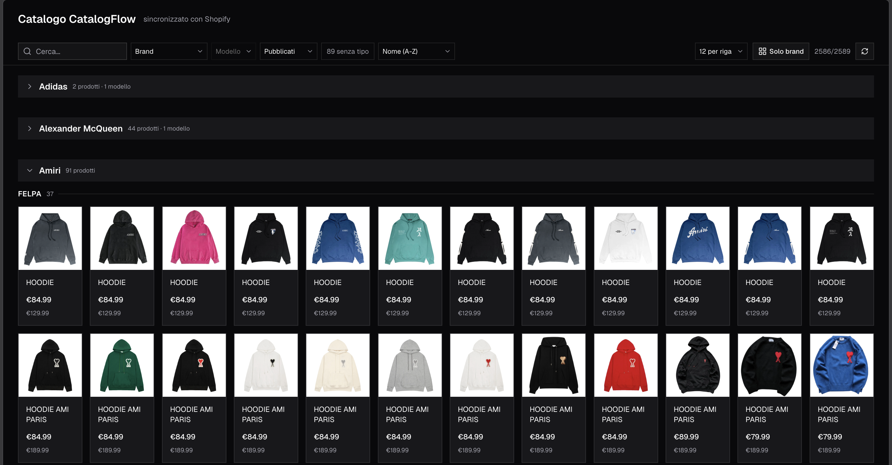

<div align="center">

# 🛍️ CatalogFlow

**Tutto il catalogo Shopify in un'unica tabella — non un prodotto alla volta.**

Web app self-hosted pensata per negozi con centinaia o migliaia di prodotti: modifiche in blocco, taglie e varianti, pulizia immagini e un login per persona. Nessun abbonamento, nessun database, nessun dato che esce dal tuo server.

[](LICENSE) [](https://nodejs.org) [](https://nextjs.org) [](docs/SHOPIFY-SETUP.it.md) [](#-contributing)

**[⚡ Installazione AI in 2 minuti](docs/AI-INSTALL-PROMPT.md)** · **[📖 Guida Shopify](docs/SHOPIFY-SETUP.it.md)** · **[🚀 Avvio rapido](#-avvio-rapido)** · **[🐳 Docker](#-docker-solo-se-lo-conosci-già)**

[🇬🇧 English](README.md) · 🇮🇹 **Italiano** · [🇫🇷 Français](README.fr.md)



</div>

## ⚡⚡ Installazione in ~2 minuti (consigliata): lascia fare a Claude Code

**Non fare i 15 minuti di passaggi a mano.** Apri **Claude Code** (o Cursor, Codex, Gemini CLI…)
in una cartella vuota e incolla il prompt pronto: clona il progetto, installa le dipendenze,
crea `.env.local`, avvia il server e ti guida nella creazione dell'app Shopify, chiedendoti
solo le due cose che non può recuperare da solo (ID client e Secret).

👉 **[Apri il prompt: docs/AI-INSTALL-PROMPT.md](docs/AI-INSTALL-PROMPT.md)** — copialo, incollalo,
rispondi alle domande. Tempo tuo richiesto: ~2 minuti invece di 15.

<i>Preferisci farlo a mano? Salta a [🚀 Avvio rapido](#-avvio-rapido) e poi a
[🔌 Creare l'app Shopify](#-creare-lapp-shopify-una-volta).</i>

---

## 👥 A chi serve (e a chi no)

**Serve a chi ha un catalogo grande** — centinaia o migliaia di prodotti — e ha bisogno di
**organizzarlo in fretta** invece di aprire e salvare un prodotto alla volta.

Serve in particolare se:

- 🗂️ hai **centinaia o migliaia di prodotti** e l'admin di Shopify diventa lento solo a scorrere

- ✏️ devi **applicare la stessa modifica a molti prodotti** (titoli, descrizioni, prezzi, tag, stato)

- 📐 devi **sistemare le taglie** prodotto per prodotto (rinominare, riordinare, eliminare varianti)

- 🖼️ devi **pulire le immagini** dei prodotti vecchi

- 👥 siete **due persone** (titolare + socio) e volete ognuno il proprio accesso, senza account ed email

**Non serve se** hai una ventina di prodotti: l'admin di Shopify basta e avanza.
Non è un'app pubblica del Shopify App Store e non c'è nessun abbonamento.

---

## ✨ Cosa fa

- **Tutto il catalogo in una tabella** — ricerca, filtri, prezzo, stato, immagini e taglie a colpo d'occhio.

- **Editor prodotto singolo** — titolo, descrizione, prezzo, tag, tipo prodotto, stato.

- **Modifiche in blocco** — la stessa modifica su una selezione di prodotti, con barra di avanzamento.

- **Taglie e varianti** — crea, rinomina, riordina ed elimina opzioni e varianti, per prodotto.

- **Immagini** — riordina ed elimina le immagini dei prodotti.

- **Metafield** — legge e scrive `custom.fornitore_url`, `custom.modello`, `custom.gruppo`.

- **Multi-utente a password** — fino a 10 account definiti via env var, senza email né database.

- **Log attività** — chi ha modificato cosa e quando (persistenza su Redis opzionale).

---


## 🧰 Requisiti

- **Node.js 20+** — oppure Docker, se lo usi già (vedi in fondo)

- Uno **store Shopify** dove poter creare un'app (qualsiasi piano)

- **15 minuti** per la configurazione Shopify iniziale (una volta sola) — o ~2 minuti con l'agente AI

---

## 🚀 Avvio rapido

```bash
git clone https://github.com/code-grind-studio/catalogflow.git
cd catalogflow
npm install
cp .env.example .env.local     # poi riempi i valori (vedi sotto)
npm run dev
```

Apri <http://localhost:3000> e accedi con `CATALOG_USER_1_ID` e `CATALOG_USER_1_PASSWORD`
impostati in `.env.local`.

> 💡 **Su macOS** puoi anche fare doppio click su **`Avvia CatalogFlow.command`**: al primo
> avvio installa le dipendenze, avvia il server e apre il browser.

> 💡 **Su Windows** fai doppio click su **`Avvia CatalogFlow.bat`** — vedi la sezione Windows qui sotto.

---

## 🪟 Su Windows, passo per passo

Non serve esperienza: sono cinque passaggi, tutti con il mouse tranne uno.

**1. Installa Node.js 20** (una volta sola)

Apri il **Terminale** di Windows (tasto destro sul menu Start → *Terminale* o *PowerShell*) e incolla:

```powershell
winget install OpenJS.NodeJS.LTS
```

Chiudi e riapri il terminale, poi verifica con `node -v` (deve rispondere `v20` o superiore).

**2. Scarica il progetto**

Nella pagina GitHub del repo: pulsante verde **Code → Download ZIP**, poi estrai la cartella
(dove vuoi, per esempio in `Documenti`). Se preferisci riga di comando:

```powershell
git clone https://github.com/code-grind-studio/catalogflow.git
```

**3. Installa le dipendenze**

Apri il **Terminale nella cartella del progetto** (apri la cartella in Esplora file, poi tasto
destro → *Apri nel terminale*) e incolla:

```powershell
npm install
```

**4. Crea il file delle impostazioni**

Sempre nel terminale:

```powershell
copy .env.example .env.local
notepad .env.local
```

Nel Blocco note riempi le voci (lascia pure vuote le `SHOPIFY_*` finché non hai fatto la
configurazione Shopify):

- `CATALOG_USER_1_ID` e `CATALOG_USER_1_PASSWORD` → l'utente con cui entrerai
- `SESSION_SECRET` → una stringa a caso lunga; va benissimo questa:

  ```powershell
  -join ((48..57)+(97..102) | Get-Random -Count 64 | % {[char]$_})
  ```

Salva e chiudi il Blocco note.

**5. Avvia**

Doppio click su **`Avvia CatalogFlow.bat`** nella cartella del progetto (oppure, dal terminale:
`npm run dev`). Si apre il browser su <http://localhost:3000>.

Per fermarlo: chiudi la finestra nera del terminale. Per riavviarlo domani: di nuovo doppio
click sul `.bat`.

> 🪟 Windows difende il computer: la prima volta può chiedere il permesso del firewall
> («Consenti accesso» su reti private) — serve per aprire la pagina su `localhost`.

---

## 🔌 Creare l'app Shopify (una volta)

CatalogFlow si autentica con **Client ID + Secret**. L'app si crea nel **Dev Dashboard** di
Shopify, si installa sul tuo store e i due valori si incollano in `.env.local`.

Guida completa con screenshot — 13 passaggi, circa 15 minuti:

- 🇮🇹 [**Configurazione app Shopify — Italiano**](docs/SHOPIFY-SETUP.it.md)

- 🇬🇧 [Shopify app setup — English](docs/SHOPIFY-SETUP.md)

- 🇫🇷 [Configuration de l'app Shopify — Français](docs/SHOPIFY-SETUP.fr.md)

Versione breve: crea l'app → pubblica una versione con gli scope
`read_products,write_products` → **Installa l'app** sul tuo store → copia **ID client** e
**Secret** in `.env.local`.

> ⚠️ L'installazione non è facoltativa: senza di essa Shopify risponde
> `400 Oauth error app_not_installed`.

---

## 🔐 Variabili d'ambiente

| Nome | Obbligatoria | Cos'è |
|---|---|---|
| `SHOPIFY_DOMAIN` | ✅ sì | il tuo dominio `xxx-yyy.myshopify.com` — non il dominio personalizzato |
| `SHOPIFY_CLIENT_ID` | ✅ sì | ID client dell'app (Dev Dashboard → Parametri dell'app → Credenziali) |
| `SHOPIFY_CLIENT_SECRET` | ✅ sì | Secret dell'app (stessa pagina — si vede per intero una sola volta) |
| `CATALOG_USER_1_ID` | ✅ sì | identificativo di login del primo utente |
| `CATALOG_USER_1_PASSWORD` | ✅ sì | password del primo utente |
| `CATALOG_USER_1_LABEL` | ➖ no | nome mostrato nell'interfaccia (default: l'ID) |
| `CATALOG_USER_2_ID` … `_10_` | ➖ no | altri utenti, stesse tre variabili (`_ID`, `_PASSWORD`, `_LABEL`) |
| `SESSION_SECRET` | ✅ sì | stringa casuale che firma il cookie di sessione (`openssl rand -hex 32`) |
| `KV_REST_API_URL` / `KV_REST_API_TOKEN` | ➖ no | credenziali REST Upstash Redis: mantengono log attività e stato import tra un riavvio e l'altro |

⏱️ La sessione dura **30 minuti**, poi richiede di nuovo la password.

---

## 🐳 Docker (solo se lo conosci già)

> ⚠️ **Se non hai mai usato Docker, salta questa sezione**: per CatalogFlow non serve. L'avvio
> normale (`npm run dev`, oppure il doppio click sul file di avvio) è più semplice e fa
> esattamente la stessa cosa sul tuo computer.

Docker serve solo se vuoi farlo girare su una macchina senza installare Node — un NAS, un
server affittato, un vecchio portatile:

```bash
cp .env.example .env.local   # riempilo prima
docker compose up --build
```

---

## ☁️ Deploy (opzionale)

[](https://vercel.com/new/clone?repository-url=https%3A%2F%2Fgithub.com%2Fcode-grind-studio%2Fcatalogflow&env=SHOPIFY_DOMAIN,SHOPIFY_CLIENT_ID,SHOPIFY_CLIENT_SECRET,CATALOG_USER_1_ID,CATALOG_USER_1_PASSWORD,SESSION_SECRET&envDescription=Shopify+Client+ID%2FSecret+%28see+docs%2FSHOPIFY-SETUP.md%29+and+the+login+user&envLink=https%3A%2F%2Fgithub.com%2Fcode-grind-studio%2Fcatalogflow%2Ftree%2Fmain%2Fdocs)

Il pulsante clona il progetto sul tuo account Vercel e ti chiede una per una le variabili
d'ambiente (Shopify Client ID/Secret e l'utente di accesso).

Oppure da terminale, nella cartella del progetto:

```bash
bash scripts/deploy.sh     # deploya e carica le variabili da .env.local
```

Qualsiasi host che esegua Node o Docker va bene allo stesso modo: basta impostare le stesse
variabili d'ambiente.
---

## ⚙️ Come funziona

- Tutte le chiamate a Shopify avvengono **lato server**: il browser non vede mai Client ID,
  Secret né token di accesso.

- Il token dell'Admin API viene richiesto con il **client credentials grant**
  (`POST /admin/oauth/access_token`), messo in cache 24 ore e rinnovato da solo — non c'è
  niente da copiare o rigenerare a mano.

- Versione Admin API: **2025-01**. Il throttling GraphQL è gestito con retry basati sul costo.

- Il login è un cookie HMAC firmato (Web Crypto) — nessun database di sessioni.

---

## 🗂️ Struttura del progetto

```
src/app/            pagine (catalogo, login) + route API
src/lib/catalog/    client Shopify, normalizzazione catalogo, taglie, tassonomia
src/components/     tabella catalogo, dialoghi prodotto, tray di selezione
docs/               guide di configurazione (EN/IT/FR) + screenshot
scripts/            helper deploy Vercel
```

---

## 🩺 Problemi frequenti

| Sintomo | Soluzione |
|---|---|
| `400 Oauth error app_not_installed` | installa l'app sul tuo store — punto 3 della guida |
| `Token exchange fallito (404)` | `SHOPIFY_DOMAIN` deve essere `xxx-yyy.myshopify.com` |
| La pagina di login si ricarica senza entrare | `SESSION_SECRET` mancante, o coppia ID/password che non combacia |
| Catalogo vuoto | store sbagliato, o versione pubblicata senza `read_products` |
| `npm` non riconosciuto su Windows | Node.js non è installato o il terminale va riaperto dopo l'installazione |

Altri casi: [docs/SHOPIFY-SETUP.it.md → Problemi frequenti](docs/SHOPIFY-SETUP.it.md#-problemi-frequenti).

---

## 🤝 Contribuire

Issue e pull request sono benvenute. Il bug report più utile dice cosa hai fatto, cosa ti
aspettavi e il messaggio d'errore esatto (l'output del terminale o il riquadro rosso nel browser).

Il progetto è volutamente piccolo — una sola app Next.js, senza livelli in più — quindi una patch
è di solito poche righe. Per cose più grandi apri prima una issue: si fa prima.

---

## 📄 Licenza

**MIT** — vedi [LICENSE](LICENSE).

Sviluppato da [@code-grind-studio](https://github.com/code-grind-studio).
